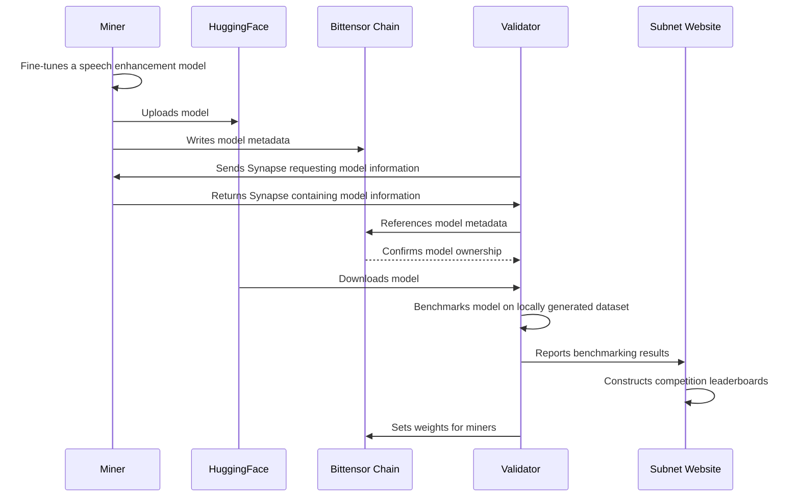

# Subnet Architecture

There are two main entities in the subnet:

1. **Miners** upload fine-tuned speech enhancement models to HuggingFace.
2. **Validators** benchmark models and determine the miners whose models perform the best.

Here is a diagram of the overarching process:

