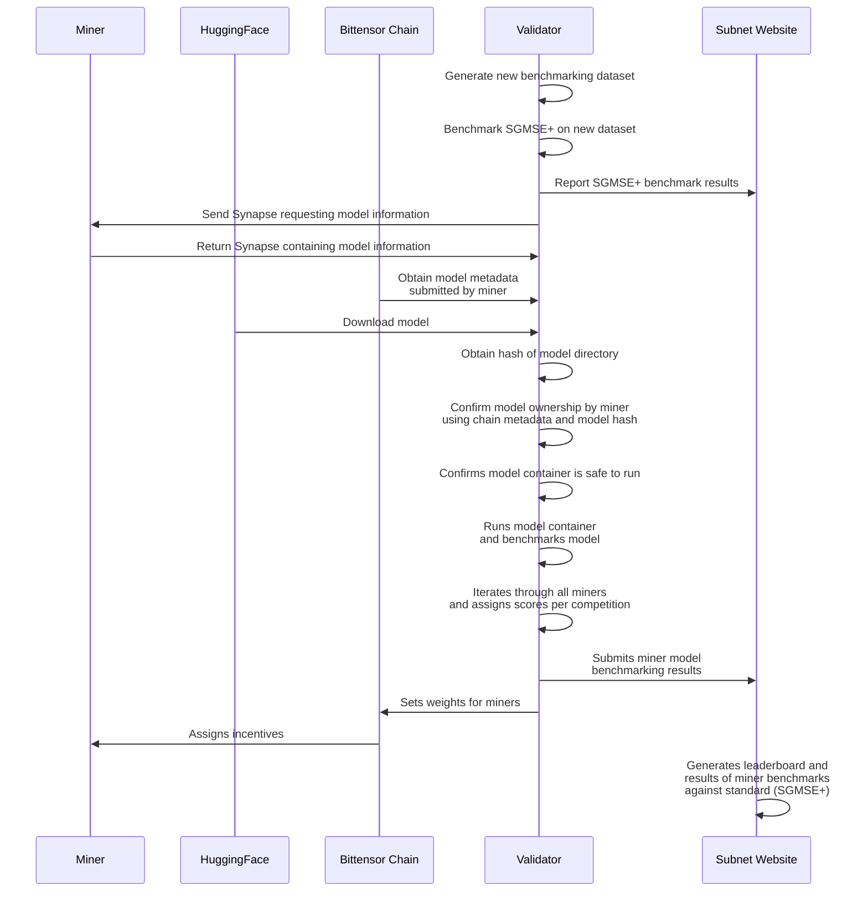

# Validator Architecture Overview

Validators on the subnet are in charge of benchmarking miner models and assigning weights for miners who submit the top performing models for each competition. Competitions span one day, and below is a diagram illustrating what the validator does during each:

